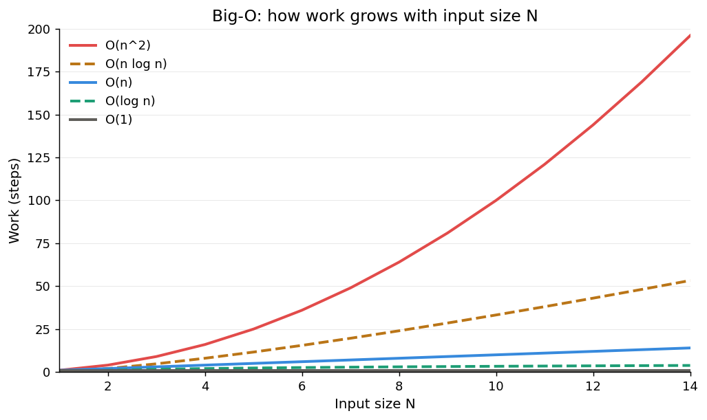

# Big-O（ビッグオー）とは

入力サイズ **N が大きくなったときに、処理にかかる手間（時間やメモリ）が「どんな勢いで増えるか」** を表す記法。
正確な秒数ではなく、**増え方の形**を表す。アルゴリズムやデータ構造が「スケールするか」を予測するための道具。

---

## 一番効く考え方

> **N が2倍になったら、仕事量は何倍になる？**

この問いに答えるのが Big-O。例えば O(n²) は「N が2倍 → 手間が4倍」。N が10倍なら手間は100倍になる。

---

## まず O(n) の読み方 — 「n に比例」（前提）

`O(n)` は **「処理の手間が、データ数 n に比例する」** という意味。
「n個を **ちょうど1回ずつ** 触る」ではなく、**「触る回数が n の定数倍に収まる」** のが O(n)。

Big-O は定数倍を無視するので、次は全部 O(n):

- n個を1周する（1n回） → O(n)
- n個を2周する（2n回） → O(n) ← 2倍でも「n に比例」なので O(n)
- n個を3回ずつ触る（3n回） → O(n)

つまり O(n) の条件は「1回ずつ」ではなく **「1要素あたり定数回の作業」**。

対比で見ると境目がつかめる:

| やっていること | アクセス回数 | クラス |
| --- | --- | --- |
| n個を1周 | n 回 | O(n) |
| n個を2周 | 2n 回 | O(n) |
| 各要素について、全要素を見る（二重ループ） | n × n = n² 回 | O(n²) |
| 半分ずつ絞る（二分探索） | log n 回 | O(log n) |

> **1要素あたり「定数回」の作業 → 全体で O(n)。
> 1要素あたり「n回（＝全部見直す）」作業 → O(n²)。**

「ループの中で毎回 `in` / `find` で探す」が O(n²) に化けるのは、各要素についてまた全部なめているから。
（→ この罠の避け方は本ノート後半と `data-structure-selection.md` を参照）

---

## よく出る計算量クラス

| 記法 | 呼び方 | N が2倍になると | 例 |
| --- | --- | --- | --- |
| O(1) | 定数 | 変わらない | map のキー引き、配列の添字アクセス |
| O(log n) | 対数 | +1ステップ程度 | 二分探索 |
| O(n) | 線形 | 2倍 | リストを端から走査 |
| O(n log n) | 準線形 | 2倍より少し多い | 良いソート |
| O(n²) | 二乗 | **4倍** | 二重ループ（全ペア比較） |
| O(2ⁿ) | 指数 | 二乗される勢い | 全部分集合の総当たり（避ける） |

上から下にいくほど、N が増えたときの伸びが急になる。

---

## 増え方の差をグラフで見る

同じ N の範囲でも、O(n²)（赤）だけが急角度で立ち上がり、O(log n)（緑）と O(1)（灰）はほぼ床に張り付いている。
この **傾きの差** こそが Big-O が表しているもの。

> 注意: 左端（N が小さい領域）では曲線同士の差がほとんどない。差が開くのは右に行ってから。
> **Big-O は「右側（大きい N）の地図」であって、「左側（小さい N）の地図」ではない。**

---

## 記法の読み方

- `O()` は「オーダー」と読む。`O(n)` は「オーダー n」「線形時間」。
- 中の式が「増え方」を表す。`n` は入力サイズ。
- 通常は **最悪計算量（上界）** を表す。「これより悪くはならない」という上限。

---

## ここがハマりどころ — 定数項を無視する

Big-O は「増え方の形」しか表さず、**定数項を無視する**。
`O(2n)` も `O(100n)` も、まとめて `O(n)` と書く。だから:

- **N が大きいときの傾向**は正確に予測できる → 設計判断の指針になる。
- **N が小さいときの実際の速さは分からない** → 「O(1) だから速い」とは限らない。

これがまさに、サイズの議論で出てきた
「小さい N では O(n) の線形探索が O(1) のハッシュマップに勝つ」現象の正体。
Big-O が等しく見えても定数項で差がつくし、Big-O で負けていても定数項で勝つことがある。

→ 詳しくは `data-structure-selection.md` の「もう一つの軸：データサイズ」。

---

## 計算量は何で決まるか — データ構造と N の役割

「データ構造と計算量」「データ数(N)と計算量」は、関わり方が **まったく別物**。混同しやすいので分けて捉える。

### データ構造 ↔ 計算量:最も強い結びつき（ほぼ決定関係）

ある操作がどの計算量クラスになるかを **決めている** のがデータ構造。
同じ操作でも、構造が違えば計算量クラスが変わる。

| 操作:「キーで値を引く」 | 計算量 |
| --- | --- |
| 配列（線形探索） | O(n) |
| ソート済み配列 / 木 | O(log n) |
| ハッシュマップ | O(1) |

**データ構造を選ぶ = その操作の計算量クラスを選ぶこと**。
逆引き表も選定判断も、結局「どの計算量を手に入れたいか → だからこの構造」という話をしている。

### データ数 ↔ 計算量:N は計算量の「変数」

計算量は最初から **N の関数** として書かれている（O(n)、O(n²)…）。N はその式の変数そのもの。
重要なのは、**N の大小は計算量クラスを変えない** こと。
配列の線形探索は N が10でも100万でも O(n) のまま。
N が変えるのは「そのクラスの差が、実時間としてどれだけ顕在化するか」＝グラフ上のどこにいるか、だけ。

### 精密化:正しくは「構造 × 操作」で決まる

計算量はデータ構造**単体**では決まらない。**構造と操作のペア**で初めて一つに定まる。
同じ配列でも操作ごとにバラバラ:

| 配列に対する操作 | 計算量 |
| --- | --- |
| 末尾追加 | O(1) |
| 先頭・中間への挿入 | O(n) |
| 添字アクセス | O(1) |
| 含有判定（線形探索） | O(n) |

だから「この構造の計算量は?」には答えられず、「この構造で **この操作** をすると?」で確定する。

### 二段で捉える

> **構造（× 操作）で計算量クラスが決まり、N でそれが実速度として顕在化する。**

- 計算量クラス（O(n) か O(1) か）→ 構造で決まり、N では変わらない。
- 実時間の勝敗 → 定数項・キャッシュ効果と、N がどこにいるかで決まる。

「小さい N では O(n) の線形探索が O(1) のハッシュマップに勝つ」のは、
**クラスは構造で固定されたまま、実時間の見え方が N で変わった** だけ。クラスと実時間は別レイヤー。

---

## まとめ（4行）

1. Big-O = 入力 N に対する手間の**増え方の形**。「N が2倍で何倍か」で捉える。
2. O(1) < O(log n) < O(n) < O(n log n) < O(n²) < O(2ⁿ) の順に悪化する。
3. **計算量クラスは「構造 × 操作」で決まる**。N はクラスを変えず、差が実時間に出る度合いを動かす。
4. **定数項は無視される** ので、大きい N の傾向は分かるが、小さい N の実速度は別途サイズで判断する。
