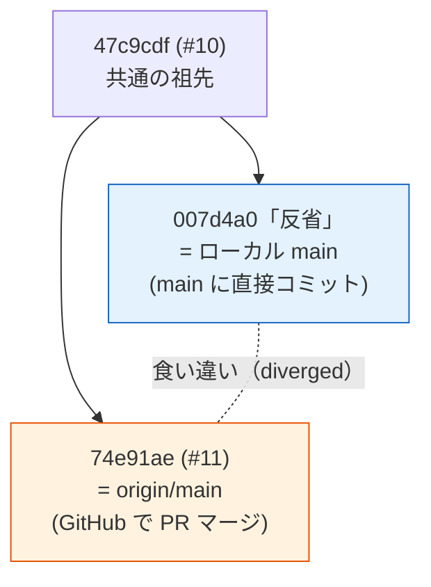

# git の「分岐（diverged）」からの復旧 — ケース記録

> 学習用メモ。実際に起きた git のトラブルを題材に、**何が起きて・なぜ起きて・どう直したか**を残す。
> 同じ状況に再び出会ったとき、ここを見れば落ち着いて対処できることを目的にする。
> 発生・復旧: 2026-06-09（題材は `2026-06-08の反省を記載` コミット）。関連: [pr-workflow.md](../pr-workflow.md)

---

## TL;DR（30秒で読む要点）

| 項目 | 内容 |
|------|------|
| **症状** | `git status` に `Your branch and 'origin/main' have diverged, and have 1 and 1 different commits each` |
| **原因** | 同じ地点から、①ローカル main への直接コミット と ②GitHub での PR マージ が**別々に積まれた** |
| **直し方** | `git pull --rebase origin main` で一直線に乗せ替え → `git push origin main` |
| **失ったもの** | **なし**（両方のコミットとも無事） |
| **教訓** | 作業前に必ずブランチを切る／push 前に `git pull --rebase`／困ったら **`git status` を読む** |

---

## 1. 何が起きたか（症状）

`git status` がこう表示した:

```
On branch main
Your branch and 'origin/main' have diverged,
and have 1 and 1 different commits each, respectively.
```

これは **「ローカルの main」と「GitHub 側の main（origin/main）」が食い違っている**という意味。`1 and 1` は「自分だけが持つコミットが1つ／相手だけが持つコミットが1つ」を表す。

| git の表示 | 読み方 |
|-----------|--------|
| `diverged` | ローカルとリモートが**共通の祖先から別々の方向へ**進んだ |
| `ahead 1` | ローカルにだけある未push のコミットが1つ |
| `behind 1` | リモートにだけある未取得のコミットが1つ |
| `ahead 1, behind 1` | 上の両方が同時 ＝ **分岐**している状態 |

> 「おかしくなった」と感じたが、**壊れてはいない**。git はただ「2つに枝分かれしたよ、どう合流させる？」と聞いているだけ。

---

## 2. なぜ起きたか（原因）

同じコミット `47c9cdf`（PR #10）を起点に、2つの操作が**並行して**行われた:

1. **ローカル**: main に直接 `2026-06-08の反省を記載`（`notes.md` に追記）をコミットした
2. **GitHub**: PR #11 をブラウザでマージした → origin/main が進んだ

その結果、main が2方向に枝分かれした:



ASCII で見ると:

```
                47c9cdf (#10) ← 共通の祖先
                 /          \
   007d4a0「反省」            74e91ae (#11)
   = ローカル main           = origin/main
   (直接コミット)            (PRマージ)
```

> **どちらの操作も“正しい”。** 悪いのは操作ではなく、**「main を直接いじる」と「リモートが進む」が重なった**こと。ブランチを切っていれば、ローカル main は origin/main と同じまま枝分かれせずに済んだ（→ 4章）。

---

## 3. どう直したか（復旧手順）

枝分かれした2つを**一直線につなぎ直す**。今回は `rebase`（乗せ替え）を使った。

### 実行したコマンド

| # | コマンド | 何をする |
|---|---------|---------|
| 1 | `git fetch origin` | リモートの最新を取得（`origin/main` を最新化）。まず**現状把握** |
| 2 | `git pull --rebase origin main` | 自分の「反省」コミットを **origin/main の先頭に乗せ替え**て分岐を解消 |
| 3 | `git push origin main` | 一直線になった main を origin へ（fast-forward） |

### rebase で何が起きたか（before → after）

```
【before】分岐                      【after】一直線
        47c9cdf(#10)               47c9cdf(#10)
        /         \                    │
 007d4a0(反省)   74e91ae(#11)          74e91ae(#11)
 ローカル         origin               │
                                       ba8285d(反省')  ← #11 の上に乗せ替え
                                       ※ hash が 007d4a0 → ba8285d に変わる
```

`rebase` は「自分のコミットを一旦よけて、相手の最新の上に積み直す」操作。だから**コミットの中身は同じだが hash が変わる**（`007d4a0` → `ba8285d`）。中身が同じファイル（`notes.md` と #11 の `multi-language-setup.md`）で**衝突しなかった**ため、自動でスッと通った。

### なぜ `merge` ではなく `rebase` か

| | `git pull`（merge） | `git pull --rebase`（今回） |
|---|---|---|
| 履歴 | **マージコミットが1つ増える**（Y字に合流） | **一直線**のまま |
| 見た目 | 枝分かれの跡が残る | きれい |
| このリポジトリとの相性 | △ | ◎（PR は `--squash` で一直線運用なので揃う） |

> 衝突が起きた場合は、rebase が途中で止まり「このファイルを直して」と言ってくる。直して `git add` → `git rebase --continue`。やめたいときは `git rebase --abort` で**元に戻せる**（怖がらなくてよい）。

---

## 4. 改善策（再発防止）

根本原因は「**main を直接いじったこと**」。次の習慣で防げる。

| 場面 | やること | なぜ効くか |
|------|---------|-----------|
| **作業を始める前** | `git checkout main && git pull` → **`git checkout -b <branch>`** | main を常に origin と同期させ、変更は必ずブランチに隔離する（[pr-workflow.md](../pr-workflow.md) ①②） |
| うっかり main に直接コミットした | push の前に **`git pull --rebase origin main`** | 分岐していても一直線に直り、余計な merge コミットを作らない |
| `push` が `rejected`（拒否）された | あわてず `git fetch` → **`git status` を読む** → 必要なら `pull --rebase` | リモートが進んでいるサイン。状況を見てから動く |
| 何が起きたか分からない | **`git status`** と **`git log --oneline --decorate`** を読む | git はたいてい状況と次の一手を教えてくれる |

### やってはいけない（今回の状況で）

- ❌ **いきなり `git push -f`（強制push）**: リモートの他人のコミット（PR #11）を消しかねない。今回は不要だった。
- ❌ **意味が分からないまま `git reset --hard`**: 必要なときもあるが、まず `git status` で理解してから。

> 補足: たとえ間違えても、ローカルの履歴は **`git reflog`** にしばらく残る。`git reset --hard <reflogのhash>` で**直前の状態に戻せる**ことが多い。「取り返しがつかない」と思い込まないこと。

---

## 5. 用語ミニ辞典

| 用語 | 意味 |
|------|------|
| **diverge（分岐）** | ローカルとリモートが共通の祖先から**別々に**進んだ状態 |
| **共通の祖先（merge base）** | 枝分かれする前の、両者が一致していた最後のコミット |
| **rebase** | コミットを別の土台の上に**乗せ替える**操作（履歴が一直線・hash は変わる） |
| **merge** | 2つの履歴を**合流**させる操作（マージコミットが増える） |
| **fast-forward** | 分岐が無いとき、ポインタを進めるだけの取り込み（新コミットを作らない） |
| **HEAD** | いま自分が見ている（チェックアウト中の）コミット |
| **origin / origin/main** | リモート（GitHub）と、その main ブランチのローカル追跡 |
| **reflog** | HEAD が動いた履歴の記録。誤操作からの復旧に使える命綱 |

---

## 6. このケースの位置づけ

[pr-workflow.md](../pr-workflow.md) の「つまずきポイント」表にある **「main に直接コミットしてしまった」** の、実際に起きた具体例＋復旧ログ。教科書の1行を、自分の手で踏んで直した記録として残す。
