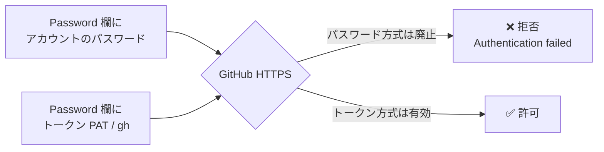
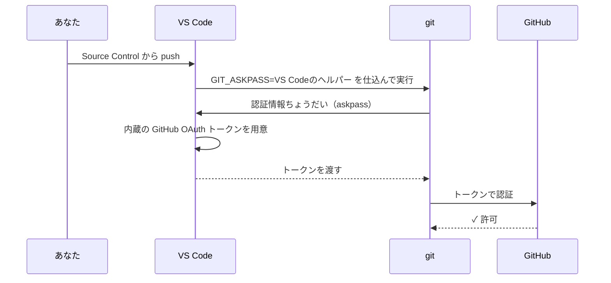
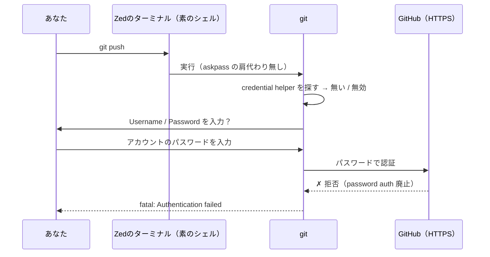
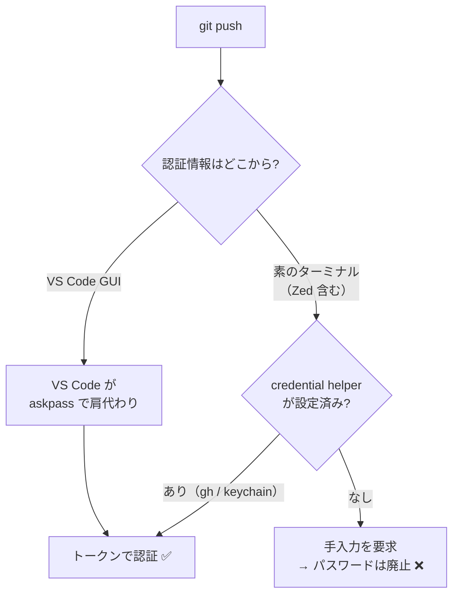
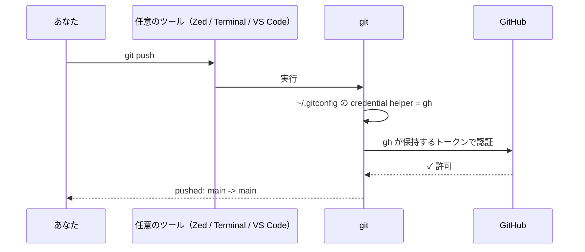

# `git push` 認証エラーの顛末 ― VS Code から Zed に乗り換えたら push できなくなった話

> 日付: 2026-06-29
> 環境: macOS / Zed（当日から使用開始）/ リモートは GitHub HTTPS
> キーワード: `Password authentication is not supported` / credential helper / `GIT_ASKPASS` / `gh auth login`

---

## TL;DR（3行まとめ）

- **症状**: Zed のターミナルで `git push` したら、ユーザー名・パスワードを聞かれ、入力しても `Authentication failed` で失敗した。
- **原因**: GitHub は **HTTPS でのパスワード認証を廃止済み**。さらに、今まで使っていた VS Code が**裏で認証を肩代わり**していたため、素のターミナル（Zed）では認証情報が無く失敗した。
- **解決**: `gh auth login` で**システム共通の認証（credential helper）**を設定 → 以後どのエディタ／ターミナルからでも push が通る。

---

## 1. 何が起きたか（時系列）

| # | 操作 | 結果 |
|---|---|---|
| 1 | VS Code では今まで普通に push できていた | ✅ 成功していた |
| 2 | 当日から **Zed** を使い始め、統合ターミナルで `git push` | ❌ 認証を聞かれる |
| 3 | Username に `mgmaru`、Password に**アカウントのパスワード**を入力 | ❌ 拒否される |
| 4 | `gh auth login`（ブラウザ認証）を実行 | ✅ 認証完了 |
| 5 | 再度 `git push` | ✅ 成功（4コミットが公開された） |

実際に出たエラー:

```text
remote: Invalid username or token. Password authentication is not supported for Git operations.
fatal: Authentication failed for 'https://github.com/mgmaru/coding-practice.git/'
```

> ポイント: **「password authentication is not supported」**＝パスワードが間違っていたのではなく、**「パスワードという方式そのもの」が使えない**。

---

## 2. 直接の原因 ― GitHub はパスワード認証を廃止している

- GitHub は **2021年8月13日** に、Git over HTTPS での**パスワード認証を完全廃止**した。
- 以降、HTTPS で認証する正しい手段は次のいずれか:
  - **Personal Access Token (PAT)** をパスワード代わりに使う
  - **`gh` CLI**（OAuth トークン）
  - **SSH 鍵**
- つまり `Password:` 欄に**ログインパスワードを入れる行為は、廃止後は常に失敗する**。



---

## 3. なぜ VS Code では通っていたのか

VS Code は**エディタ自身に GitHub 認証の仕組みが組み込まれている**。

- push 時に `GIT_ASKPASS` / `VSCODE_GIT_ASKPASS` という環境変数を仕込み、**認証の問い合わせを VS Code 自身の UI / GitHub 連携に横取り**させる。
- そのため、**システム側に認証設定が無くても、VS Code が裏でトークンを用意して git に渡してくれる**。
- ユーザー視点では「何も設定していないのに普通に push できる」状態に見えていた。



> つまり VS Code のトークンは「**VS Code が抱えていただけ**」で、素のターミナルからは見えなかった。

---

## 4. なぜ Zed のターミナルでは失敗したのか

Zed の統合ターミナルで打った `git push` は、**ただの素のシェル**。VS Code のような askpass の横取りは効かない。

- git は**システム共通の認証設定（credential helper）**を見にいく。
- そこに有効な認証情報が無い → 仕方なく `Username:` / `Password:` を**手入力で聞く**。
- そこにパスワードを入れる → **GitHub はパスワード方式を廃止済み** → 失敗。



---

## 5. 核心 ― 認証は「エディタごと」ではなく「システム共通」

ここが今回いちばん誤解しやすい点。

- **Git の認証情報そのものは、エディタごとではなくシステム共通**（macOS キーチェーンや `gh` の credential helper に保存される）。
- ただし **「認証情報をどう git に渡すか」はツールによって違う**。
  - VS Code → 自前で肩代わり（askpass）できる
  - 素のターミナル（Zed / Terminal.app）→ システムの credential helper に頼る
- だから**設定が無いと「Zed だけ失敗」しているように見える**が、実際は「VS Code だけが特別に面倒を見てくれていた」だけ。

| ツール | 認証情報の入手元 | 共通設定なしで通る? |
|---|---|---|
| VS Code（Source Control パネル） | VS Code 内蔵の GitHub 連携（askpass） | ✅ 自前で肩代わり |
| VS Code のターミナル | システムの credential helper | ⚠ 設定次第 |
| **Zed のターミナル** | システムの credential helper | ❌ 設定が無いと失敗 |
| 素の Terminal.app | システムの credential helper | ❌ 設定が無いと失敗 |
| **`gh auth login` 後（全ツール）** | `gh` の credential helper（共通） | ✅ どこでも通る |



---

## 6. `gh auth login` は何をしたのか

`gh auth login` は内部で2つのことをやってくれる。

1. **ブラウザの OAuth でログインし、有効なアクセストークンを取得**する（＝パスワードの代わりになる「トークン」を入手）。
2. **git の認証ヘルパーをシステム共通として自動設定**する。`~/.gitconfig` に次のような設定が入る:

```ini
[credential "https://github.com"]
    helper =
    helper = !/opt/homebrew/bin/gh auth git-credential
```

これにより、次回以降の `git push` では git は**もうパスワードを聞かず**、`gh` が持つトークンを**自動でパスワード欄に渡す**。



### 失敗時 ↔ 解決後

| | 失敗していたとき | `gh auth login` 後 |
|---|---|---|
| git が送る認証情報 | **アカウントのパスワード** | `gh` が持つ **OAuth トークン** |
| GitHub の反応 | パスワード方式は廃止 → 拒否 | トークン認証 → 許可 |
| 毎回の入力 | 手入力（しかも失敗） | credential helper が自動投入 |
| 効く範囲 | VS Code だけ（自前肩代わり） | **全ツール共通** |

---

## 7. 認証方式の選択肢（参考）

| 方式 | 仕組み | 向いている人 | 毎回入力 |
|---|---|---|---|
| **`gh` CLI**（今回これ） | OAuth トークン + credential helper を自動設定 | 一番楽に済ませたい | 不要 |
| **PAT**（classic / fine-grained） | トークンをパスワード欄に入力、keychain に保存 | gh を入れたくない | 初回のみ |
| **SSH 鍵** | 公開鍵を GitHub に登録、`git@github.com:...` で接続 | 恒久的に安定させたい | 不要 |

> HTTPS（gh / PAT）と SSH は**別系統**。どちらか一方を設定すれば OK で、両方は不要。

---

## 8. 確認・トラブルシュート用コマンド

```bash
# いまのログイン状態（gh）
gh auth status

# git がどの credential helper を使う設定か
git config --get credential.helper

# リモートが HTTPS か SSH か
git remote -v

# 未 push のコミットを確認
git log --oneline origin/main..HEAD

# push 後、追従できているか
git status   # → "Your branch is up to date with 'origin/main'." なら完了
```

- **トークンには有効期限がある**。切れたら再認証を求められる → `gh auth login` をもう一度、または `gh auth refresh`。
- `[no tests to run]` 同様、push も「成功表示」を鵜呑みにせず、`git status` が `up to date` になったかで最終確認するのが安全。

---

## 9. まとめ（教訓）

- **GitHub はパスワード認証を廃止済み** ― HTTPS の `Password:` にログインパスワードを入れても必ず失敗する。
- **認証情報はエディタごとではなくシステム共通** ― ただし「どう渡すか」はツールで違う。VS Code は自前で肩代わりするので“設定不要”に見えていた。
- **素のターミナル（Zed 含む）はシステムの credential helper に頼る** ― そこが空だと手入力 → 失敗。
- **`gh auth login` で共通の認証を入れたら恒久解決** ― エディタを乗り換えても、ターミナルから push する分にはそのまま通る。

> 一言で: 「Zed が悪い」のでも「エディタごとに毎回必要」でもなく、**今までは VS Code が裏で面倒を見てくれていただけ**。今回それを**システム共通の正しい形**で入れ直したので、これで解決。

---

## 付録: 用語集

| 用語 | 意味 |
|---|---|
| **PAT**（Personal Access Token） | パスワードの代わりに使う、GitHub が発行するトークン |
| **credential helper** | git が認証情報を保存／取得する仕組み（例: `osxkeychain`, `gh auth git-credential`） |
| **`GIT_ASKPASS`** | git が認証情報を聞くときに呼ぶ外部プログラムを指定する環境変数。VS Code はこれで認証を横取りする |
| **OAuth** | ブラウザ経由でトークンを発行する認証方式。`gh auth login` が使う |
| **HTTPS リモート / SSH リモート** | `https://github.com/...`（トークン認証）と `git@github.com:...`（鍵認証）の2系統 |
