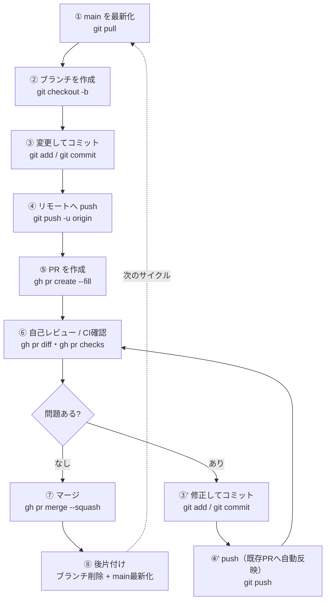

# ブランチ → PR → マージの1サイクル（運用手順）

[運用ルール](../README.md#運用ルール) の「作業はブランチ + Pull Request で行い、CI・CodeQLの指摘に対応してから自分でマージする」を、実際のコマンドに落とした手順書。
1つの変更を **ブランチ作成 → コミット → push → PR → 自己レビュー → マージ → 後片付け** の順で1周させる。これを毎回の作業単位にする。

## 全体像



> ポイント: **mainには直接コミットしない**。必ず②でブランチを切る。
> ⑥で問題が見つかったら **③'→④'（同じブランチで修正コミット → push）** に戻る。push すると **既存のPRに自動で反映される** ので、⑤のPR作成はやり直さない（同じPRが更新される）。指摘が解消するまで「⑥ ↔ ③'④'」を繰り返し、解消したら⑦へ進む。

## ステップ別コマンド早見表

| # | ステップ | コマンド例 | 何のため |
|---|---------|-----------|---------|
| ① | mainを最新化 | `git checkout main && git pull origin main` | 最新の状態から枝分かれする |
| ② | ブランチ作成 | `git checkout -b docs/xxx` | 作業を隔離する |
| ③ | コミット | `git add <file> && git commit -m "..."` | 変更を記録する |
| ④ | push | `git push -u origin docs/xxx` | リモートへ上げPRの土台を作る |
| ⑤ | PR作成 | `gh pr create --fill` | レビュー・マージの単位を作る |
| ⑥ | 確認 | `gh pr diff` / `gh pr checks` / `gh pr view --web` | 自己検収・CI確認 |
| ⑦ | マージ | `gh pr merge <番号> --squash --delete-branch` | mainへ取り込む |
| ⑧ | 後片付け | `git checkout main && git pull origin main` | mainを最新化し次へ |

## 各ステップの詳細

### ① main を最新化
```bash
git checkout main
git pull origin main
```
古いmainから枝分かれすると、後でコンフリクトしやすい。**作業開始前に必ず最新化**する。

### ② ブランチを作成
```bash
git checkout -b docs/clarify-purpose-roles-rubric
```
`-b` は「作って切り替える」。ブランチ名は **種別/内容** の形が分かりやすい（例: `docs/...`, `feat/...`, `fix/...`）。
今いるブランチは `git branch --show-current` で確認できる。

### ③ 変更してコミット
```bash
git add README.md docs/review-rubric.md   # 対象を指定（"git add ." は不要なものまで入りやすい）
git commit -m "変更の要約（何をなぜ変えたか）"
```
コミットメッセージも練習対象。1行目に要約、本文に理由を書く。

### ④ リモートへ push
```bash
git push -u origin docs/clarify-purpose-roles-rubric
```
- `-u`（`--set-upstream`）を付けると、以降このブランチでは `git push` / `git pull` だけで済む。
- **ブランチ名は省略しない**。`docs/` などのプレフィックスを落とすと `src refspec ... does not match any` エラーになる（[つまずきポイント](#つまずきポイント)参照）。

### ⑤ PR を作成
```bash
gh pr create --fill        # コミット内容からタイトル・本文を自動で埋める（最も手軽）
```
他の作り方:

| コマンド | 動き |
|---------|------|
| `gh pr create` | 対話形式（タイトル・本文・Submitを順に聞かれる）|
| `gh pr create --fill` | コミットから自動入力して即作成 |
| `gh pr create --title "..." --body "..."` | タイトル・本文を指定して即作成 |
| `gh pr create --web` | ブラウザのPR作成画面を開く |

base（マージ先）は自動で `main`、head（変更元）は今のブランチになる。

### ⑥ 自己レビュー / CI確認
```bash
gh pr diff            # 差分をターミナルで確認
gh pr view --web      # ブラウザでPRを開き Files changed を見る
gh pr checks          # CIの結果を見る（CI未導入なら "no checks reported"）
```
**このリポジトリの学習の肝**。自分の変更を他人のコードのように読み返し、レビュー観点（[review-rubric.md](./review-rubric.md)）で見直す。
問題が見つかったら **同じブランチで修正してコミットし、`git push` し直す**。既存のPRが自動で更新されるので、`gh pr create`（⑤）はやり直さない。指摘が解消するまでこれを繰り返してから⑦へ進む。

### ⑦ マージ
```bash
gh pr merge 1 --squash --delete-branch
```

| オプション | 意味 | 使いどころ |
|-----------|------|-----------|
| `--squash` | ブランチのコミットを1つにまとめてmainへ | 履歴をきれいに保ちたい（学習用の既定推奨）|
| `--merge` | マージコミットを作って取り込む | ブランチの履歴をそのまま残したい |
| `--rebase` | コミットを並べ替えてmainへ乗せる | 直線的な履歴にしたい |
| `--delete-branch` | マージ後にローカル＆リモートのブランチを削除 | 後片付けを同時に済ませる |

### ⑧ 後片付け
```bash
git checkout main
git pull origin main
```
`--delete-branch` を付けていればブランチ削除は済んでいる。手動で消すなら:
```bash
git branch -d docs/clarify-purpose-roles-rubric        # ローカル
git push origin --delete docs/clarify-purpose-roles-rubric   # リモート
```

## つまずきポイント

| 症状 | 原因 | 対処 |
|------|------|------|
| `src refspec xxx does not match any` | push時のブランチ名が実在の名前と違う | `git branch --show-current` で正確な名前を確認して push |
| pushで毎回ブランチ名を打つのが面倒 | upstreamが未設定 | 初回に `git push -u origin <branch>` を使う |
| vimが開いて抜けられない | 対話モードで本文エディタが起動した | `Esc` → `:wq` → Enter で保存して閉じる。苦手なら `--fill` や `--web` を使う |
| mainに直接コミットしてしまった | ②のブランチ作成を忘れた | コミット前なら先にブランチを切る。済んだ場合は別途相談 |
| 見覚えのないブランチが残っている | 過去のpush/作成ミスの残骸 | `git branch` で一覧し、不要なら `git branch -D <名前>` で削除 |

## 用語ミニ辞典

| 用語 | 意味 |
|------|------|
| `origin` | リモートリポジトリ（GitHub側）の既定の呼び名 |
| upstream | ローカルブランチが追跡するリモートブランチ。`-u` で設定 |
| base | PRの**マージ先**ブランチ（このリポジトリでは `main`）|
| head | PRの**変更元**ブランチ（自分の作業ブランチ）|
| squash | 複数コミットを1つに圧縮すること |

## このリポジトリ特有の注意

- **CIは段階導入**: pytest + Ruff のCIは Phase 2、CodeQL は Phase 3 で追加予定。それまで `gh pr checks` は「no checks reported」になる（異常ではない）。
- **AIプロダクトオーナー方式と接続**: 機能開発のサイクルでは、PRは「AIがPO役で発行したIssue」を閉じる単位になる（[ai-workflow.md](./ai-workflow.md)）。`gh pr merge` 時に `--body "Closes #<Issue番号>"` を含めたPRなら、マージでIssueも自動クローズされる。
- **AI採用コードの明記**: AIが書いたコードを採用した場合は、コミットメッセージに「採用した旨と自分が検証した内容」を残す（[運用ルール](../README.md#運用ルール)）。
