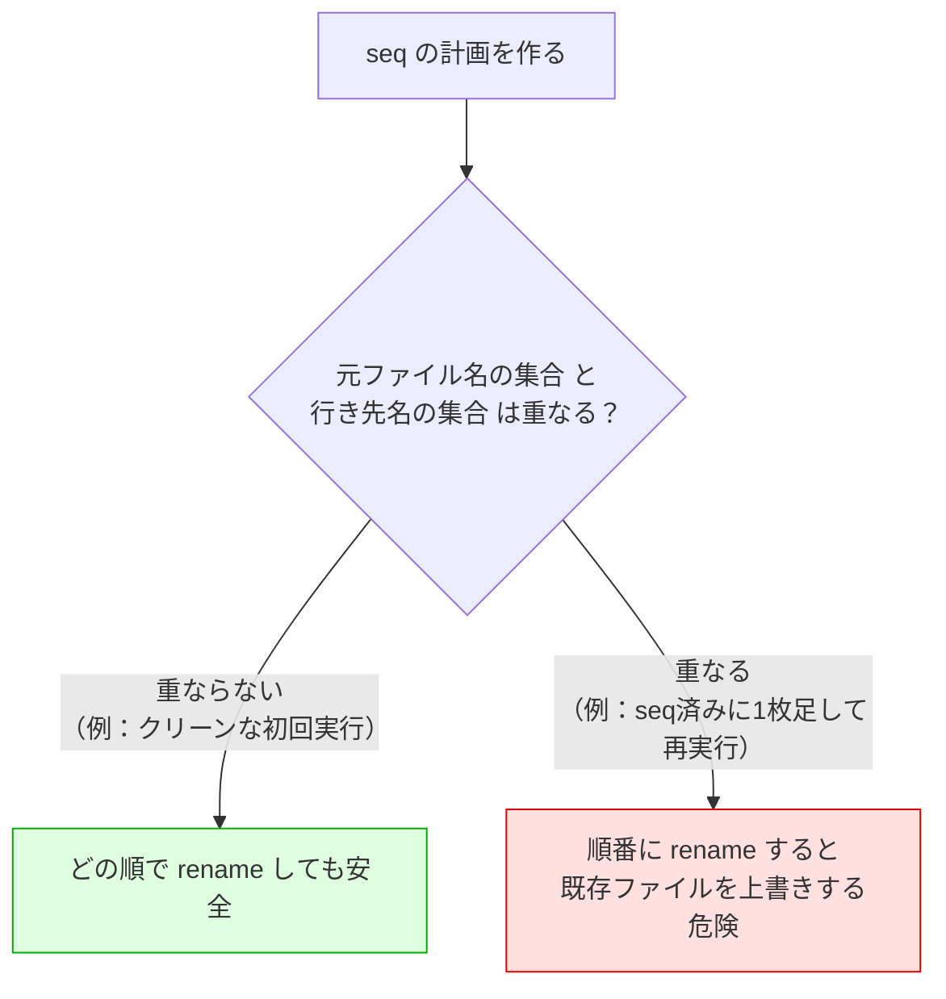
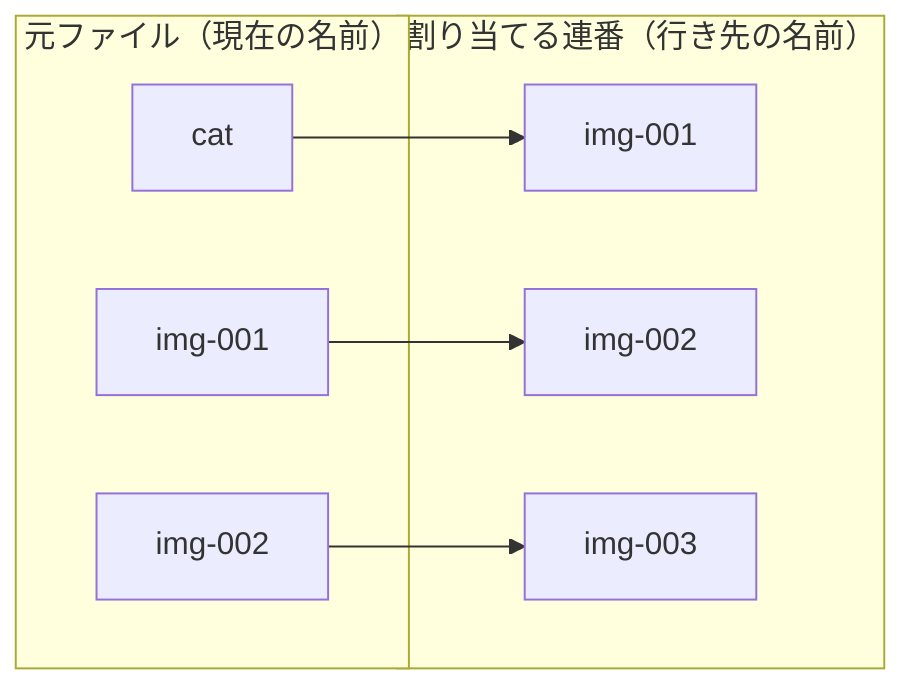
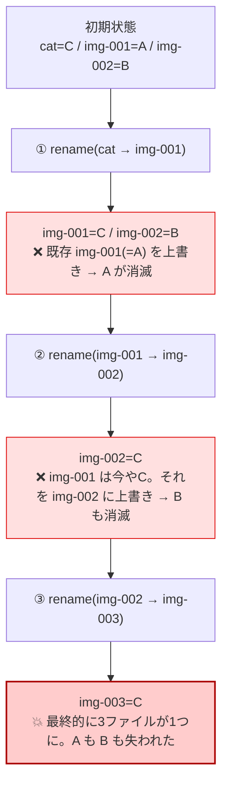
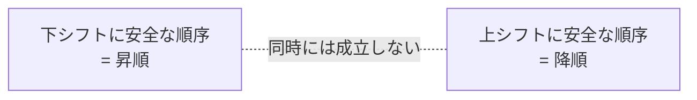
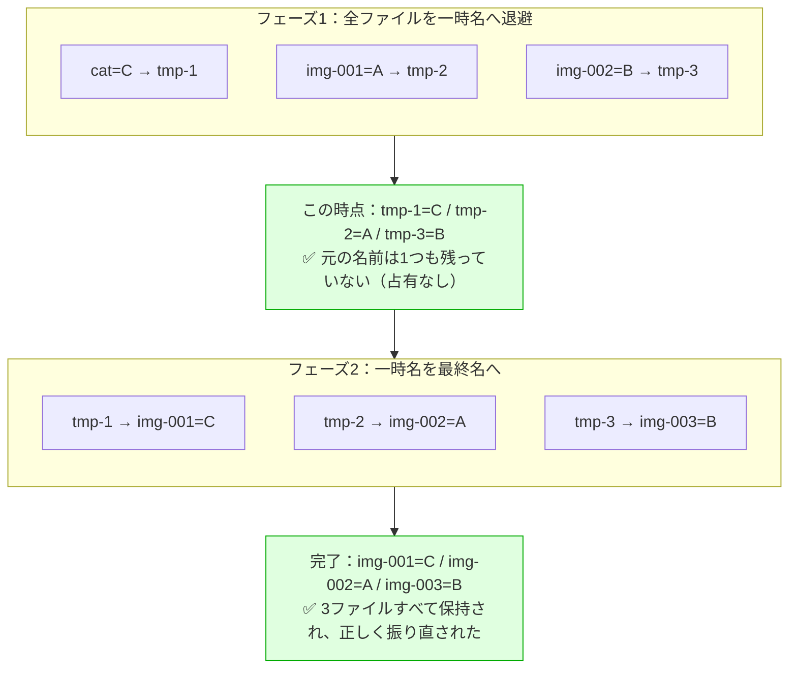
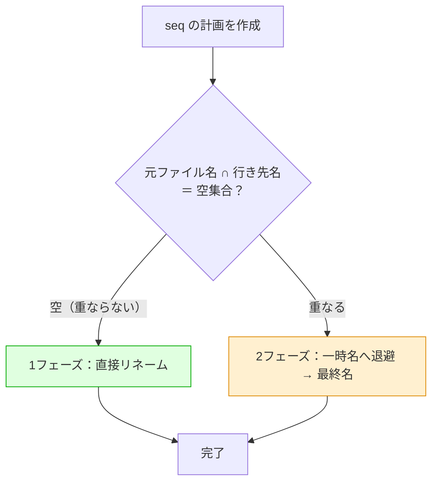
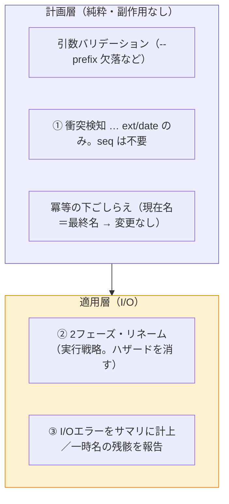

# `seq` の連番リネームにおける「上書きハザード」と安全な解法

## 0. このドキュメントの目的

`refile` の `seq`（対象ディレクトリのファイルを `<prefix>-001`, `<prefix>-002`, … へ連番リネームする機能）について、当初「**ファイルの衝突は起きない**」と整理していた。

これは **半分正しく、半分見落としがある**。

- 正しい点：`seq` は最終的なファイル名が必ず一意になるので、README が定義する「衝突」（複数ファイルの行き先が同じになる）は起きない。
- 見落とし：**1回の実行（初回）しか想定していなかった**。「すでに `seq` 済みのディレクトリにファイルを足して、もう一度実行する」場合、`os.Rename` を素朴に順番に呼ぶと **既存ファイルを黙って上書きして壊す**可能性がある。

このドキュメントは、その見落としの中身を例で示し、**robust（堅牢）な解法＝2フェーズ・リネーム**の考え方を説明する。

> ⚠️ このドキュメントには実装コードは載せない。**考え方**だけを示すので、実装は各自で行うこと。

---

## 1. 前提：`seq` 仕様のおさらい

- 対象ディレクトリ内のファイルを、`<prefix>-001`, `<prefix>-002`, … へ**連番でリネーム**する（サブフォルダは作らない）。
- 番号は**拡張子で区別せず、ディレクトリ全体で通し番号**。ただし並び順は「まず拡張子ごと → その中でファイル名昇順」でソートしてから割り当てる。
- `--recursive` を付けても `seq` ではサブディレクトリを対象にしない（＝対象は常に**1つのディレクトリ直下**）。

ここで重要なのは、**対象が1つのディレクトリ直下に閉じている**こと。つまり「元ファイル」も「行き先の名前」も**同じディレクトリの中**にある。だから両者が**ぶつかりうる**。

---

## 2. 当初の認識：「`seq` に衝突は起きない」— どこまで正しいか

### 2.1 正しい点：最終名は必ず一意

各ファイルにソート順で**ユニークな番号**が振られるため、最終的な名前 `prefix-001, prefix-002, …` が2つと重なることはない。

→ README が定義する **「衝突」=「複数の元ファイルの最終的な行き先（パス）が同じになる」** は、`seq` では構造的に発生しない。**この結論は正しい。**

### 2.2 でも「衝突」と「上書きハザード」は別物

ここを区別することが、このドキュメントの肝。

| 用語 | 意味 | `seq` で起きる？ |
| --- | --- | --- |
| **衝突（README定義）** | 複数の元ファイルの**最終的な行き先**が同じパスになる | **起きない**（最終名は一意） |
| **上書きハザード（本書のテーマ）** | リネームを**順番に実行する途中**で、行き先の名前を**まだ動かしていない別の元ファイル**が占有している | **起きうる** |

- 「衝突」は **計画段階**の概念で、`--on-conflict skip|error` で対処する話。
- 「上書きハザード」は **適用（apply）段階の実行順序**の問題で、`--on-conflict` では対処できない。**実装側が安全に処理する責務**。

つまり「`seq` に衝突はない」は正しいが、それは「`seq` の apply が自動的に安全」を意味しない。

### 2.3 用語定義：「衝突」と「上書きハザード」は別物（機能ごとに分かれる）

設計中に一番混乱しやすいのが、この2つを**同じもの**として扱ってしまうこと。定義を固定して、はっきり分ける。

**衝突（conflict）**

- **定義**：複数の元ファイルの**最終的な行き先（パス）が同一**になること。または**宛先に別の既存ファイルがいる**こと（README定義）。
- **性質**：**静的**。計画（元 → 先のペア一覧）を見るだけで、**実行しなくても**判定できる。
- **層**：**計画層**（副作用なし）。
- **対処**：`--on-conflict skip|error`（検知して報告・スキップ）。

**上書きハザード（overwrite hazard）**

- **定義**：リネームを**順に実行している途中**で、ある行き先名を**まだ処理していない別の元ファイル**が占有していて、それを黙って潰してしまうこと。
- **性質**：**動的**（実行順序に依存）。計画のペア一覧が完全に正しく（＝**衝突ゼロ**でも）起きうる。
- **層**：**適用層**（I/O）。
- **対処**：実行戦略＝**2フェーズ・リネーム**（検知ではなく構造的に回避）。

| 観点 | 衝突 | 上書きハザード |
| --- | --- | --- |
| 一言でいうと | 行き先が **"重なる"** | 実行途中で **"占有される"** |
| 静的 / 動的 | 静的（計画だけで判る） | 動的（実行順序に依存） |
| 属する層 | 計画層 | 適用層 |
| いつ分かるか | 実行前に検知できる | 被害は実行しないと起きない（計画からは"起きうる"としか言えない） |
| 対処 | `--on-conflict` | 2フェーズ・リネーム |

### 2.4 なぜ機能（ext/date と seq）で分かれるのか

`ext`/`date` は**ファイルの移動**、`seq` は**ファイルのリネーム**で、**機能として別物**として設計するのが正しい。ただし本質は「移動かリネームか」そのものではなく、**行き先の名前空間が元と分離しているか**にある（移動／リネームはその見える化された代理指標）。

| 機能 | 操作 | 行き先の名前空間 | 主に相手にする問題 | 起きない方 |
| --- | --- | --- | --- | --- |
| `ext` / `date` | 移動（サブフォルダへ） | **元と分離**（`<dir>/pdf/` など） | **衝突**（`--on-conflict`） | カスケード型の上書きは起きない |
| `seq` | リネーム（同ディレクトリ内） | **元と共有**（同じディレクトリ直下） | **上書きハザード**（2フェーズ） | README定義の衝突は起きない |

- 名前空間が**分離**していれば、「元の名前」と「行き先の名前」がぶつからない → カスケード型の上書きは構造的に起きない。
- 名前空間を**共有**していると、両者が重なりうる → 上書きハザードが起きる。

> ⚠️ 注意：`ext`/`date` にも「**宛先に既存の別ファイルがいる**」という*上書きっぽい*ケースはある。ただしこれは README では**衝突**に分類され `--on-conflict` で扱うもので、`seq` の**カスケード型の上書き**とは別物。「ext/date の上書き懸念は衝突の一種（on-conflict 側）」と覚えておくと再混同しない。

---

## 3. 見落とし：再実行時の「上書きハザード」

### 3.1 どんな状況で起きるか

ひとことで言うと **「元ファイル名の集合」と「行き先の名前の集合」が重なるとき**。

- **クリーンな初回実行**（`cat.png`, `dog.jpg`, … のように、まだ `prefix-NNN` という名前のファイルが1つも無い）なら、元ファイル名と行き先名は1つも重ならない → **安全**。
- **再実行**（前回 `seq` して `img-001`, `img-002` … になっているところへ、新しいファイルを足してもう一度実行）すると、行き先名 `img-001` などが**既存ファイルの名前と重なる** → **危険**。

### 3.2 具体例（`cat` を足して再実行）

前回 `seq --prefix img` を実行して、ディレクトリは `img-001`, `img-002` になっているとする。
そこへ新しいファイル `cat`（`c` は `i` より前にソートされる）を1つ足して、もう一度 `seq --prefix img` を実行する。

並び順は `cat` → `img-001` → `img-002`。連番を振り直すと、計画（元 → 行き先）はこうなる：

ここで注目：**`img-001` が「元ファイルの名前（s2）」にも「行き先の名前（d1）」にも現れている**。これが「集合の重なり」であり、ハザードの正体。

### 3.3 何が起きるか：カスケード崩壊

記号を決める：

- `cat` の中身 = **C**
- 既存 `img-001` の中身 = **A**
- 既存 `img-002` の中身 = **B**

計画リスト（昇順）を、`os.Rename` で**上から順番に**実行する：

1. `cat → img-001`
2. `img-001 → img-002`
3. `img-002 → img-003`

`os.Rename` は **Unix系では行き先が存在しても黙って上書きする**（エラーにならない）。順に追うと：

ポイント：

- 単に1ファイルが消えるだけでなく、**手順①で作った `img-001`（中身C）を、手順②が「元ファイル」と勘違いして使ってしまう**ため、被害が連鎖（カスケード）する。
- 計画は最初に「名前のペア」で固定しているのに、実行の途中で**同じ名前のファイルの中身が入れ替わっている**ことが原因。
- `os.Rename` は失敗しない（＝エラー件数にも上がらない）。**黙って成功して壊す**のが一番こわい。README の「黙って壊さない」の真逆になってしまう。

> 拡張子を残す仕様でも同じことが起きる。例：`seq` 済みの `img-001.jpg`, `img-002.jpg` に `beach.jpg`（`b` < `i`）を足して再実行 → `beach.jpg → img-001.jpg` が既存 `img-001.jpg` を上書きする。

---

## 4. なぜ「実行順序を工夫するだけ」では防げないのか

「じゃあ並べ替えれば安全では？」と考えたくなるが、**単一の固定順序では普遍的に守れない**。番号が動く向きで、安全な順序が逆になるから。

| シフトの向き | 例 | 昇順で実行 | 降順で実行 |
| --- | --- | --- | --- |
| **下シフト**（番号を詰める） | `img-002, img-003` → `img-001, img-002` | ✅ 安全 | ❌ 壊れる |
| **上シフト**（前に1枚挿入して押し上げ） | `cat` 挿入で `img-001→img-002`, … | ❌ 壊れる | ✅ 安全 |
| **上下シフトの混在** | 挿入＋番号の歯抜け など | ❌ | ❌ |

- **下シフト**：昇順なら「先に空けてから次が入る」ので安全。降順だと逆に壊れる。
- **上シフト**：降順なら安全。昇順だと（3.3 のように）壊れる。
- **混在**：1回の実行で上にずれるファイルと下にずれるファイルが同居すると、**どんな固定順序でも守れない**。最悪は循環（名前を互いに取り合う）になり、順序の工夫だけでは原理的に解けない。

→ 結論：**「正しい順序を選ぶ」アプローチは、混在・循環で破綻する。**

---

## 5. 安全な解法：2フェーズ・リネーム

### 5.1 考え方

> 「行き先の名前」を、**まだ動かしていない元ファイルが絶対に占有していない状態**を作ってから、最終名を付ける。

そのために、リネームを**2段階**に分ける：

1. **フェーズ1（退避）**：すべての対象ファイルを、**既存名とも最終名とも絶対に衝突しない一時名**へリネームする（例：`.refile-tmp-1`, `.refile-tmp-2`, …）。
2. **フェーズ2（確定）**：各一時名を、本来の最終名 `prefix-NNN` へリネームする。

フェーズ1が終わった時点で、**元の名前は1つも残っていない**。だからフェーズ2で最終名を付けるとき、その名前を「まだ動かしていない元ファイル」が占有していることが**構造的にありえない** → 上書きが起きない。

### 5.2 同じ例（`cat` を足して再実行）を2フェーズで

3.3 のカスケード崩壊と比べると、**1つもファイルが失われていない**ことがわかる。

### 5.3 軽量化（任意）：重なるときだけ2フェーズ

毎回2フェーズにすると rename 回数が2倍になる。そこで：

- **「元ファイル名の集合」と「行き先名の集合」が重ならない**なら（＝3.1 の安全側、クリーンな初回など）、従来どおり**直接リネーム（1フェーズ）**でよい。
- **重なるときだけ**2フェーズに切り替える。

これなら、よくある「クリーンな初回」のコストは増えず、危険なときだけ安全策を取れる。

### 5.4 設計上の注意点（実装前に決めておくこと）

- **一時名の付け方**：既存ファイル名・最終名・他の一時名のいずれとも衝突しないこと。隠しファイル風の接頭辞（例 `.refile-tmp-`）＋通し番号など、ぶつかりにくい名前を選ぶ。万一その一時名が既に存在する事態も想定して名前を決める。
- **部分失敗**：フェーズ2の途中で失敗すると、一時名のファイルが残る可能性がある。README 方針どおり**ロールバックはしない**が、**残った一時名をサマリ（エラー）で必ず報告**し、ユーザが手で復旧できる情報を出す。
- **冪等との関係**：すでに全ファイルが正しい連番に並んでいる（現在名＝最終名）なら、そもそも何もしない（冪等）。2フェーズに入る前に、この「変更なし」判定でガードしておくと無駄な退避が減る。
- **適用範囲**：この問題は `seq` 固有（同一ディレクトリ内で名前を付け替えるため）。`ext` / `date` は「サブフォルダへ移動」なので行き先名前空間が元と分かれており、このカスケードは起きにくい（ただし「行き先に別ファイルが既にいる」境界ケースは別途 `--on-conflict` で扱う）。

---

## 6. 設計方針：3つの概念を分けて実装する

ここまでで、`seq` の安全性には**混同しやすい3つの概念**が絡むことが分かった。これらを1つの塊で考えると「2フェーズにすればエラーは起きない」のような誤った飛躍が生まれる。**別々の軸として分けて設計する。**

### 6.1 3つの概念

| | 何か | いつ | 扱い方 | `seq` では |
| --- | --- | --- | --- | --- |
| ① **衝突（conflict）** | 複数ファイルの最終的な行き先が同じパス | **計画時に検知** | `--on-conflict skip\|error` で対処 | **起きない**（最終名は一意）→ 実装不要 |
| ② **上書きハザード** | 実行順序の途中で、行き先名を未処理の元ファイルが占有し、黙って上書き | 適用時 | **検知ではなく、2フェーズ・リネームで構造的に回避** | **起きうる** → 設計で消す |
| ③ **I/Oエラー** | 権限なし／実行中に消えた／一時名が既存／ディスク不足／フェーズ2の残骸 など | 適用時に発生 | **防げない。サマリの「エラー」に計上**（DoD） | **残る** → 必ず実装 |

**キモ**：② は「検知して報告するエラー」ではない。`seq` では *エラーとして表に出さず、2フェーズで起きないように作る*もの。② がエラーとして立ち現れるのは **2フェーズ自体が途中で失敗したとき**だけで、そのときは ② ではなく **③（一時名の残骸など）** に落ちる。

### 6.2 層で分ける

- **計画層**：`seq` は ①衝突・②上書きを**実装しない**。残るのは引数バリデーションと冪等判定（「変更なし」）だけ。
- **適用層**：②（2フェーズという*やり方*）と ③（実行中に出るエラーの計上）をここで実装する。

### 6.3 実装の進め方（このリポジトリの現状）

1. **いま：`seq` の計画時** — `ext`/`date` は実装済み。`seq` は「1ファイル → 最終名」を計算するだけ。**①衝突・②上書きは実装しない**（構造的に起きない／適用層の責務）。引数バリデーションと冪等判定は入れる。
2. **次：`seq` の適用時** — ここで ②（2フェーズ・リネーム、重なるときだけの軽量化は任意）と ③（部分失敗を中断せず続行し、エラー件数と一時名の残骸をサマリ報告）を実装する。

> つまり「計画時に衝突・上書きを考えない」は正しい省略だが、それは**エラーを無視してよい**という意味ではない。エラー（③）は軸が違い、適用層で必ず引き受ける。

---

## 7. まとめ

| 論点 | 結論 |
| --- | --- |
| `seq` に README 定義の「衝突」は起きるか | **起きない**（最終名は一意） |
| では `seq` の apply は無条件に安全か | **いいえ**。再実行などで「上書きハザード」が起きうる |
| ハザードが起きる条件 | **元ファイル名の集合と行き先名の集合が重なる**とき（例：seq済みに1枚足して再実行） |
| 実行順序の工夫で防げるか | **防げない**（上シフト/下シフト/混在で必要な順序が矛盾、最悪は循環） |
| 安全な解法 | **2フェーズ・リネーム**（全部を一時名へ退避 → 最終名へ）。重なるときだけ適用する軽量化も可 |
| `--on-conflict` で対処すべきか | **No**。これは衝突ではなく実行順序の安全問題で、実装側の責務 |

**一言でいえば**：`seq` は「衝突」はないが、「**再実行時の連番リネームの上書き**」という別の落とし穴がある。**2フェーズ・リネーム**で、最終名を付ける前に元の名前を全部空にしておけば、安全に振り直せる。ただし①衝突・②上書き・③I/Oエラーは**別の軸**であり（§6）、②を設計で消しても③は残る。**計画時に衝突・上書きを考えないこと**と、**適用時にエラーを計上すること**は両立させる。
